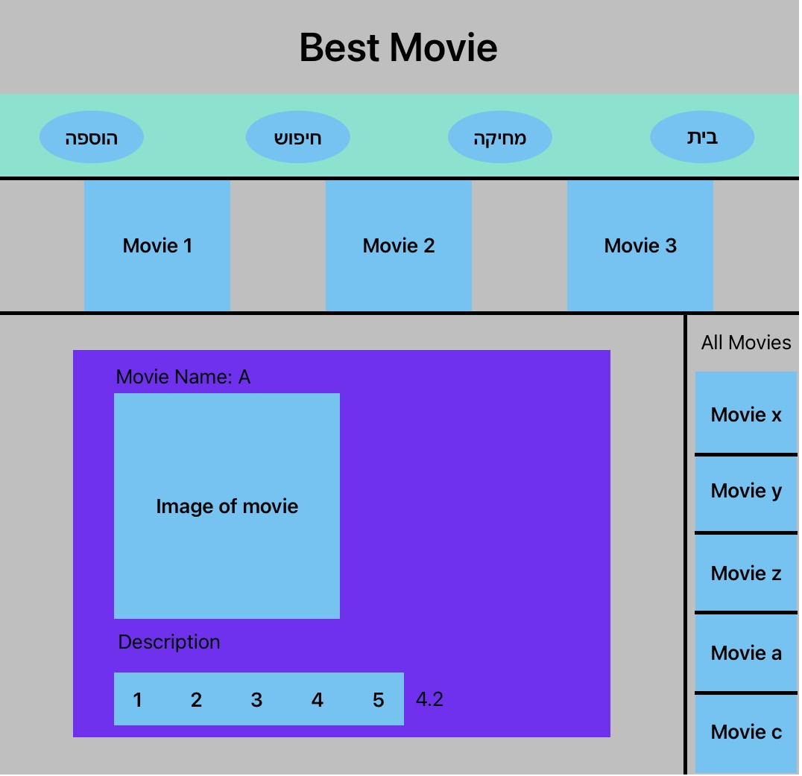
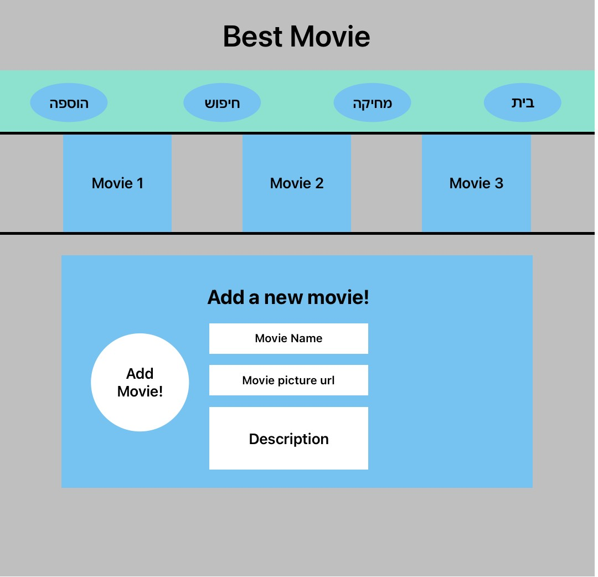
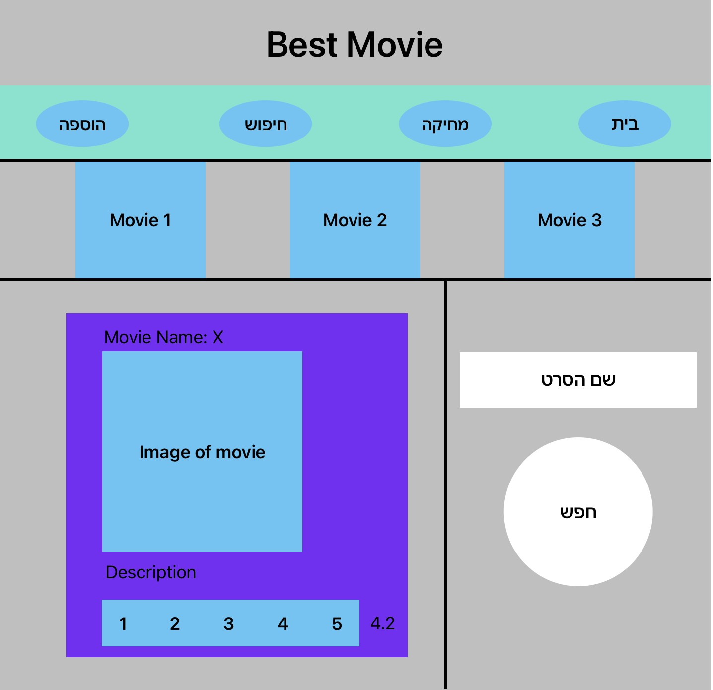
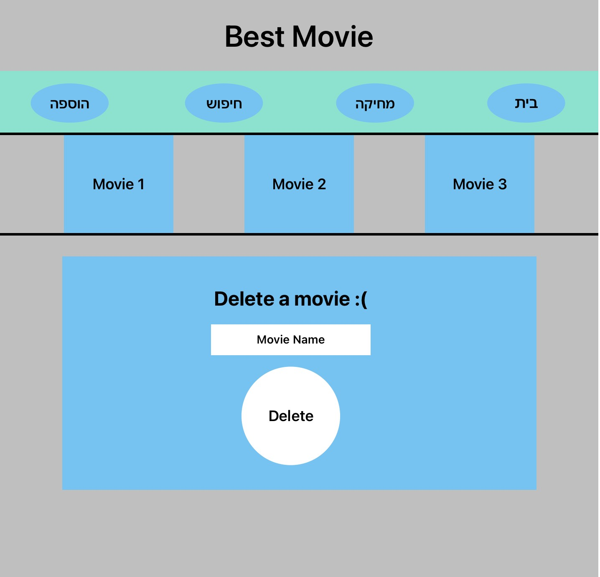

**פרוייקט**

יש לבנות אתר לדירוג סרטים

תמונה לדוגמא של מסך הבית:  
![A screenshot of a movie

**מטרת האפליקציה**

לאפשר למשתמש לדרג את הסרטים, להוסיף סרטים, להציג את שלושת הסרטים המדורגים בדירוג הגבוה ביותר לפי ממוצע הדירוג של כלל הגולשים , להציג 5 סרטים רנדומליים בצד ימין.

**חלק עליון**

לאפליקציה זו כותרת קבועה Best Movie במרכז.

מתחתיה נאב באר עם 4 כפתורים, בית , הוספה , מחיקה , חיפוש.

כל סרט מוצג בקובייה אשר הרקע של הקובייה הינו תמונת הסרט ובמרכזו – שם הסרט.

**חלק ימין**

מתחת לחלק זה מופיעה מצד ימין רשימה של 5 סרטים רנדומליים. הסרטים מופיעים בסדר לפי ה א'-ב'. (מהאות הקטנה לאות הגדולה).

גם כאן כל סרט מוצג בקובייה אשר הרקע של הקובייה הינו תמונת הסרט ובמרכזו – שם הסרט.

**עמוד הבית:**

במרכז העמוד כברירת מחדל מופיע הסרט הפופולרי ביותר

בהתחלה מוצג המשפט :movie name ולאחר מכן שם הסרט.

מתחת מוצגת תמונת הסרט ומתחתיה תיאור הסרט.

מתחת לזה בצדו הימני מופיע סרגל דירוג (כוכב אחד עד חמישה כוכבים) אשר יאפשר לדרג את הסרט. הדירוג הממוצע מוצג בצד הימני של הסרגל.

\*\*לחיצה על כל אחד מהמספרים תוסיף את הדירוג לסרט הרלוונטי, תעדכן את ממוצע הדירוגים ותציג אותו

שמות ותיאורי הסרטים יופיעו בשפה האנגלית.

לחיצה על כל אחת מ"קוביות הסרט" בחלק הימני או העליון באפליקציה תשנה את הסרט הנוכחי אשר מוצג על גבי החלק המרכזי (מעבר לזה לא ישתנה כלום).

עמוד הוספת סרטים:

העמוד בנוי 5 אלמנטים:

כותרת , 2 אינפוטים , שדה טקסט גדול להוספת תיאור, וכפתור הוספה.

שם הסרט חייב להיות באנגלית, גם אם המשתמש כתב הכל באותיות קטנות / גדולות, אנחנו נמיר את - בונוסThis Is A What We Will Show To User. זה לפני הוספת הסרט לכיתוב תקין

התמונה לא חובה.

תיאור הסרט חייב להיות באנגלית בלבד עד 200 תויים.

בלחיצה על Add Movie נקבל התראה מתאימה אם יצרנו סרט חדש או אם הייתה בעיה ביצירה עקב שגיאות משתמש.

עמוד חיפוש סרט:

עמוד חיפוש הסרט יפתח מצד ימין אינפוט וכפתור חיפוש.

האינפוט יקבל את שם הסרט שאנו מחפשים, הסרט לא חייב להכתב במלואו.

במידה ואין סרט כפי שנכתב , נתריע למשתמש שאין סרט כזה.

במידה והמלל שכתבנו מביא מספר תוצאות שונות, נתריע למשתמש איזה סרטים נמצאו ושיבחר אחד מהם. (ניתן לעשות זאת עם אלמנט select שיופיע אך ורק אם יש יותר מתוצאה אחת, במידה ויש יותר מתוצאה אחת ניתן להציג אלמנט select שכל option שלו יהיה אחד הסרטים שנמצאו.)

עמוד מחיקה:

![A screenshot of a movie

עמוד המחיקה מקבל שם מלא של סרט (לא חלקי) , במידה ומוצא הוא מוחק אותו.

במידה ולא מתריע למשתמש שאין סרט כזה.